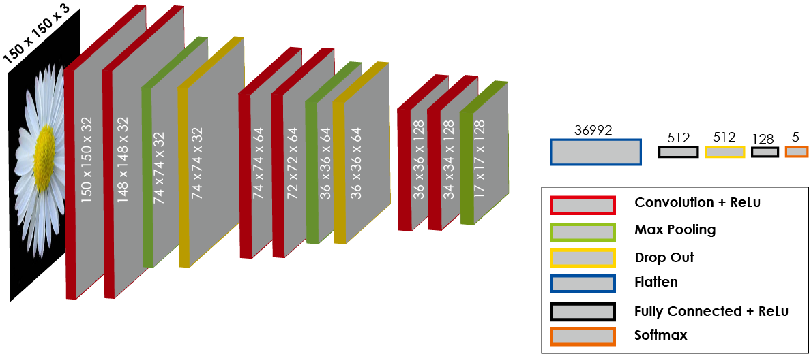
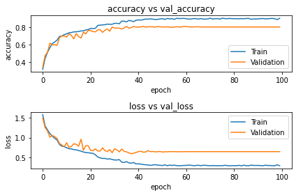
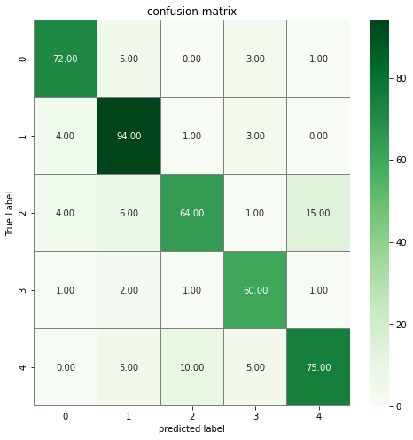
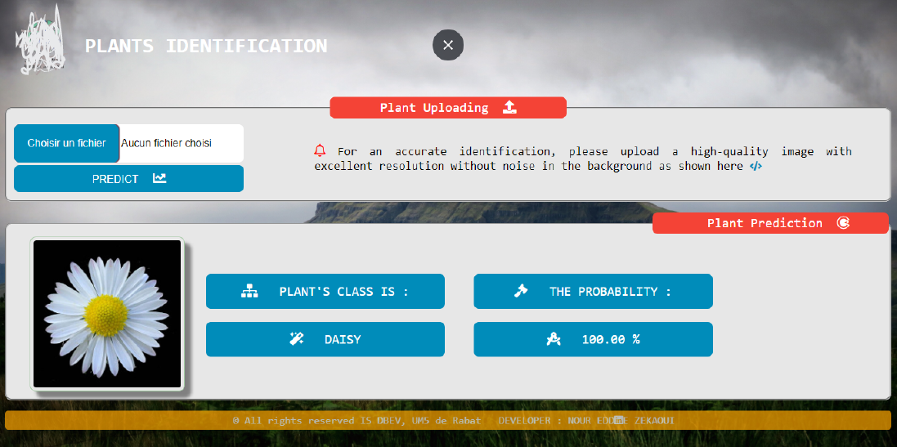

# Plants Identification by Deep Learning
>Plants Identification by Deep Learning at SI which is perfectly done and explained in [Plants Identification VF](./notebooks/Plants_Idenification_VF.ipynb) Jupyter NoteBook file.


### Table of Contents
We'll go through the next steps, but don't forget to take a look at the [Jupyter Notebook file](./notebooks/Plants_Idenification_VF.ipynb).

- [Introduction](#introduction)
- [Technologies](#technologies)
- [Data Section](#data-section)
- [CNN Architecture](#cnn-architecture)
- [Required Libraries](#required-libraries)
- [CNN Architecture Implementation](#cnn-architecture-implementation)
- [Plotting Results](#plotting-results)
- [Model Deployment](#model-deployment)
- [Author Info](#author-info)
### Introduction

"Automated species identification was presented 15 years ago as a challenging but very promising solution for the development of new research activities in Taxonomy, Biology or Ecology. However, identifying a plant for a botanist means associating a scientific name to an individual plant. More precisely, that means assigning that individual plant to a group, called a taxon. Such taxon had a name selected according to a set of rules. The delimitation of taxa and the scientific names applying to them are the result of a process called taxonomy (or systematics)".[Taken from](https://hal.archives-ouvertes.fr/hal-01913277/document)

Our project aims to create a solution that can identify a plant in an automated way. so I’m going to implement full CNN from scratch using Keras with a TensorFlow backend. This implementation will be performed on a dataset of five different kind flower. These flowers are daisy, dandelion, rose, sunflower and tulip.

### Technologies

- Python (Keras, Scikit-learn, Numpy, Pandas, Seaborn, and Matplotlib)
- Google Colab (Colaboratory)
### Data Section

* ***Context***

This dataset contains 4242 images of flowers. The data collection is based on the data flicr, google images, yandex images. You can use this datastet to recognize plants from the photo. This dataset is available on [KAGGLE | LINK](https://www.kaggle.com/alxmamaev/flowers-recognition) or you can access it from this [repo](./data)

* ***Content***

The pictures are divided into five classes: chamomile, tulip, rose, sunflower, dandelion. For each class there are about 800 photos. Photos are not high resolution, about 320x240 pixels. Photos are not reduced to a single size, they have different proportions!

> Many thanks to **[Davide Pollicino](https://github.com/omonimus1)** for the **[reminder](https://github.com/zekaouinoureddine/Plants_Identification_DL_SI/issues/1)**
### CNN Architecture
This is how our CNN architecture looks like !



#### Required Libraries

```python
    """
      Here we are going to use Keras library 
      with a tensorflow backend
    """
    import keras
    from keras.models import Sequential
    from keras.layers import Conv2D, MaxPool2D, Dense, Flatten, Dropout
```
#### CNN Architecture Implementation 

```python
    model = Sequential() 
    model.add(Conv2D(filters=32, kernel_size=(3,3), padding='same', input_shape=X_train.shape[1:], activation='relu', name='Conv2D_1'))    
    model.add(Conv2D(filters=32, kernel_size=(3,3), activation='relu', name='Conv2D_2')) 
    model.add(MaxPool2D(pool_size=(2,2), name='Maxpool_1')) 
    model.add(Dropout(0.25)) 
    model.add(Conv2D(filters=64, kernel_size=(3,3), padding='same', activation='relu', name='Conv2D_3')) 
    model.add(Conv2D(filters=64, kernel_size=(3,3), activation='relu', name='Conv2D_4')) 
    model.add(MaxPool2D(pool_size=(2,2), name='Maxpool_2')) 
    model.add(Dropout(0.25)) 
    model.add(Conv2D(filters=128, kernel_size=(3,3), padding='same', activation='relu', name='Conv2D_5')) 
    model.add(Conv2D(filters=128, kernel_size=(3,3), activation='relu', name='Conv2D_6')) 
    model.add(MaxPool2D(pool_size=(2,2), name='Maxpool_3')) 
    model.add(Flatten()) 
    model.add(Dense(units=512, activation='relu', name='Dense_1')) 
    model.add(Dropout(0.5)) 
    model.add(Dense(units=128, activation='relu', name='Dense_2')) 
    model.add(Dense(units=no_of_classes, activation='softmax', name='Output'))   
```
#### Plotting Results


- From the Training and Validation Accuracy graph above, our model does not seem to be overfitted, which is great!
- Also, Our Training and Validation Loss graph above also indicates a good learning rate.



Note that, 0,1,2,3,4 values in this matrix means daisies, dandelions, roses, sunflowers, tulips respectively
- Our confusion matrix indicates that a lot of prediction errors came from distinguishing between rose and tulip.
#### Model Deployment
Given the impressive results we obtained, we are going to deploy our model using django framework in python. Our simple web app will allow us to identify a plant by loading it, then we can easily see its type (or classe) accompanied by a measure of certainty (Probability).
here you can see how our web app interface looks like:



You can find the source code [here](https://github.com/zekaouinoureddine/Plants_Identification_DL_Model_Deployment_Django)!
### Author Info

- LinkedIn - [Nour Eddine ZEKAOUI](https://www.linkedin.com/in/nour-eddine-zekaoui-ba43b1177/)
- Twitter - [@NZekaoui](https://twitter.com/NZekaoui)
#### Thank you for your intrest ☻

[BACK TO THE TOP](#plants-identification-by-deep-learning)
